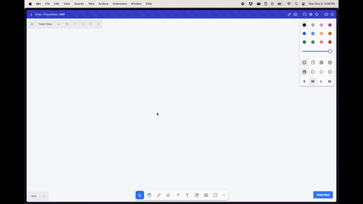

# draw-a-ui

This is a repo that uses tldraw and the gpt-4-vision api to generate UIs based on an image you draw.



> Disclaimer: This is a proof of concept and is not intended for production use. It doesn't have any auth so you will go broke if you deploy it.

## Getting Started

This is a Next.js app. To get started run the following commands in the root directory of the project. You will need an OpenAI API key with access to the GPT-4 Vision API.

```bash
echo "OPENAI_API_KEY=sk-your-key" > .env.local
npm install
npm run dev
```

Open [http://localhost:3000](http://localhost:3000) with your browser to see the result.
